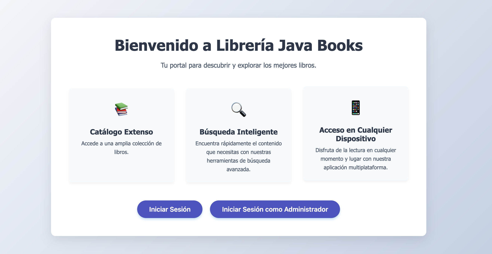
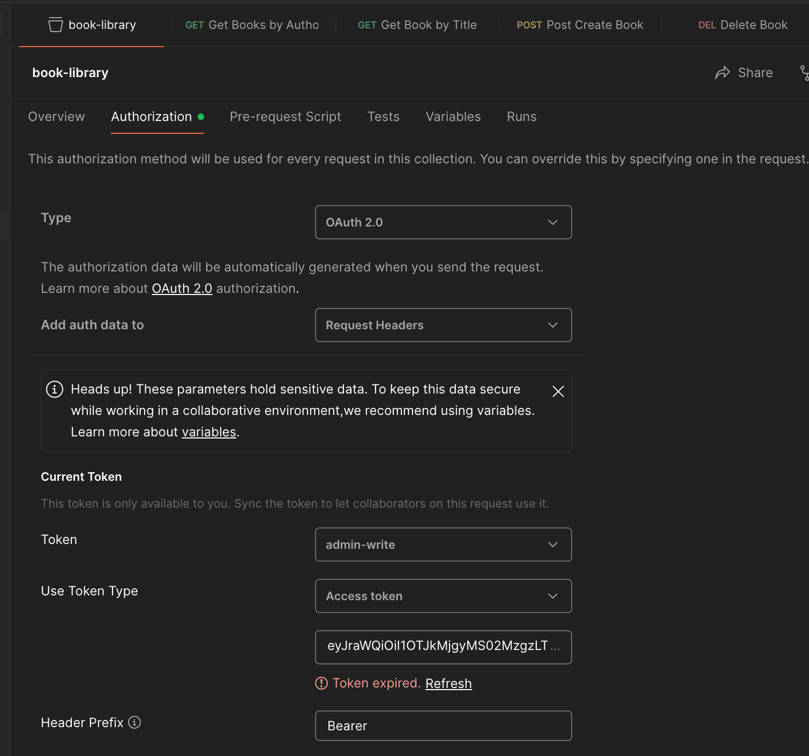
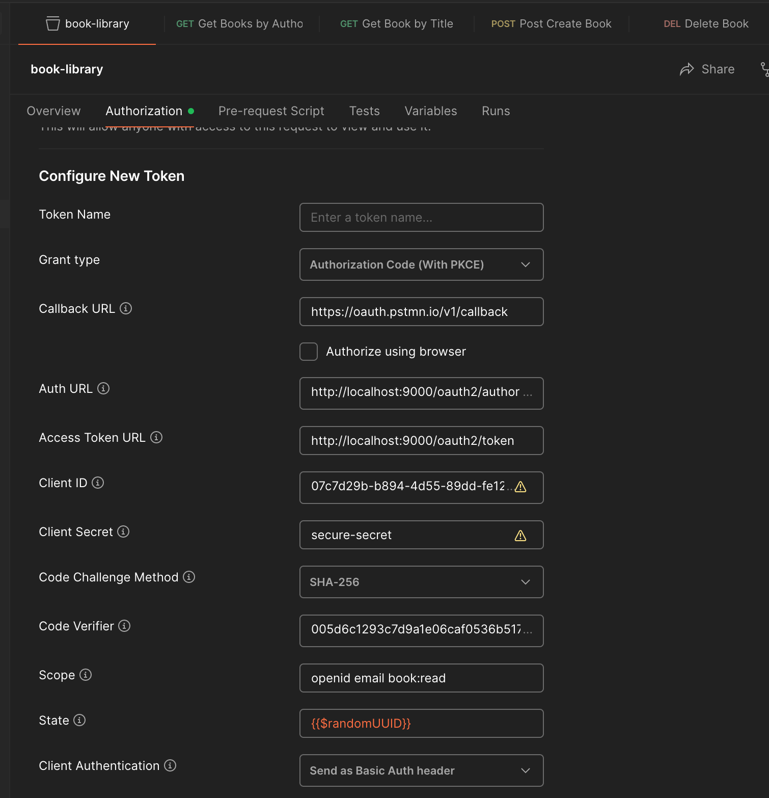

# Auth Server POC - Librería Java Books

## Resumen
Este repositorio contiene una Prueba de Concepto (POC) para un sistema auth server con Spring Boot / Spring Security que se encarga de la autenticación, autorización y control de acceso. 

## Estructura de la Data de Usuario
Cada usuario en el sistema está definido con los siguientes atributos. Todos los usuarios comparten la misma contraseña: password
- **username**
- **password**
- **role**: Nivel de acceso (ADMIN, CLIENT)
- **scope**: Permisos (openid, email, book:read, book:write)
- **categories**: Categorías a las que el usuario tiene acceso (Novela, Ensayo, Poesía)
- **authors**: Autores a los que el usuario tiene acceso (Julio Cortázar, Gabriel García Márquez, Mario Vargas Llosa, Miguel de Cervantes, Rómulo Gallegos)

## Ejemplos Usuarios Data en Memoria

### Usuario
```
username: user
password: password
role: CLIENT
scope: book:read
categories: [CATEGORY_NOVELA]
authors: [AUTHOR_CORTAZAR]
```

### Usuario 1
```
username: user-1
password: password
role: CLIENT
scope: openid email book:read
categories: [CATEGORY_NOVELA, CATEGORY_ENSAYO]
authors: [AUTHOR_CORTAZAR, AUTHOR_GARCIA_MARQUEZ]
```

### Usuario 2
```
username: user-2
password: password
role: CLIENT
scope: openid email book:read
categories: [CATEGORY_POESIA]
authors: [AUTHOR_VARGAS_LLOSA, AUTHOR_GALLEGOS]
```
- nota: el Usuario 2 no podría ver ninguna data, ya que los autores *Mario Vargas Llosa* y *Rómulo Gallegos* no tienen *Poesías* dentro del sistema

### Usuario 3
```
username: user-3
password: password
role: CLIENT
scope: openid email book:read
categories: [CATEGORY_ENSAYO]
authors: [ALL]
```

### Admin
```
username: admin
password: password
role: ADMIN
scope: openid email book:read book:write
categories: [ALL]
authors: [ALL]
```

- nota: un admin puede no tener permisos de escritura si no se solicita el scope book:write

## Setup Instructions
1. Clonar el repositorio
2. Package los microservicios con el comando
 ```bash
    mvn clean install
 ```
3. Levantar los microservicios con el comando
 ```bash
    docker compose up --build
 ```

## Flujo con un navegador
1. Acceder a http://localhost:4200
2. Iniciar sesión como usuario o administrador



## Flujo de Autenticación usando Postman
1. Type: ***OAuth 2.0***
2. Header Prefix: ***Bearer***
3. Grant type: ***Authorization Code (with PKCE)***
4. Callback URL: https://oauth.pstmn.io/v1/callback
5. Auth URL: http://localhost:9000/oauth2/authorize
6. Access Token URL: http://localhost:9000/oauth2/token
7. Client ID: ***07c7d29b-b894-4d55-89dd-fe126f5dda0d***
8. Client Secret: ***secure-secret***
9. Code Challenge Method: ***SHA-256***
10. Code Verifier: ***005d6c1293c7d9a1e06caf0536b5171d7cb0247da0be5d86fabdabe3***
11. Scope: ***openid email book:read*** (para Admin incluir book:write)
12. State: ***{{$randomUUID}}***
13. Client Authentication: ***Send as Basic Auth Header***




## API Endpoints

### Librería Java Books
- GET `/api/v1/books/title/{title}` - Consulta de libro por título. Retorna el libro que coincida con el título proporcionado.
- GET `/api/v1/books/author/{author}` - Consulta de libros por autor. Retorna todos los libros escritos por el autor proporcionado.

##### Nota: si se obtiene como respuesta una lista vacía, significa que el usuario no tiene los permisos para ver los autores/categorías consultadas.

- POST `/api/v1/books` - Alta de libro.
  ```json
  {
    "title": "La casa verde",
    "author": "Mario Vargas Llosa",
    "amountPages": 376,
    "category": "Novela",
    "content": "Se caracteriza por la asimilación de las nuevas técnicas narrativas de autores europeos y estadounidenses desarrolladas a lo largo de la primera mitad del siglo XX"
  }
  ```
- DELETE `/api/v1/books/{id}` - Baja de libro. Id del libro que se desea eliminar.

#### Los siguientes endpoint están de manera informativa solamente, para saber que data hay en el sistema sin inspeccionar la base de datos. Pueden ser consultados por ADMIN y CLIENT 
- GET `/api/v1/books/categories` - Consulta de todas las categorías en el sistema.
- GET `/api/v1/books/authors` - Consulta de todas las categorías en el sistema.
- GET `/api/v1/books/titles` - Consulta de todos los títulos de libros en el sistema.
